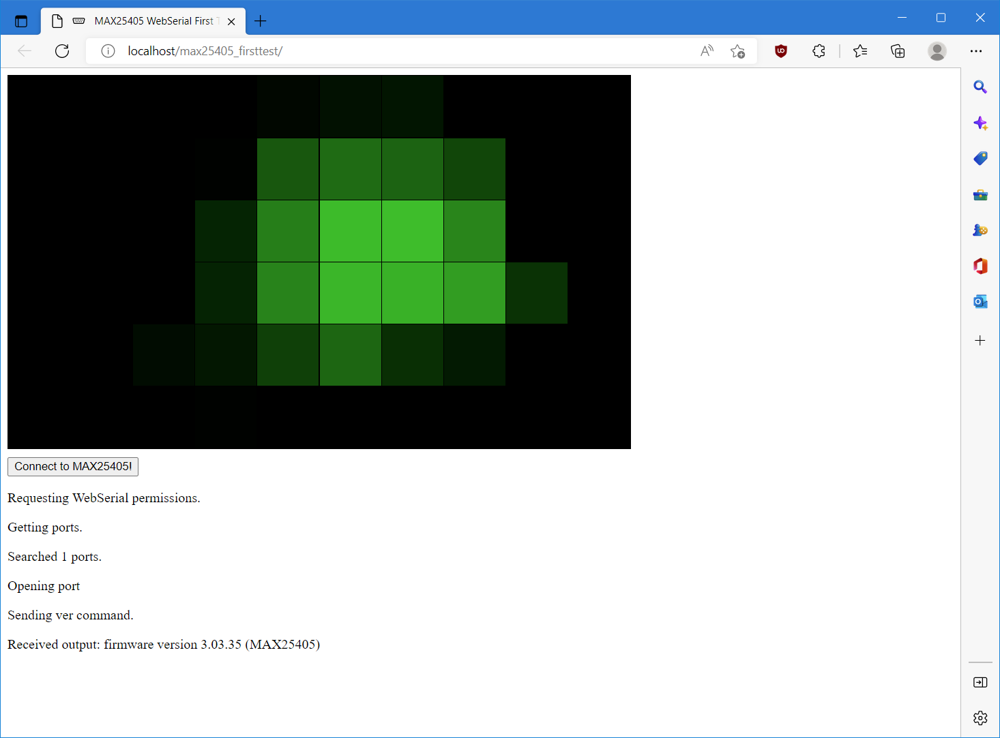

# MAX25405EVKIT WebSerial Demo

This project contains demonstration web application demonstrating communication with [Maxim Integrated MAX25405 Gesture Sensor Evaluation Kit](https://www.maximintegrated.com/en/products/sensors/MAX25405EVKIT.html) using WebSerial API from JavaScript/TypeScript. Application is deployd at [my website](https://misaz.cz/Public/MAX25405_WebSerialDemo/). After connecting to device application execute `ver` command and then draw heat map based on RAW data from ADC accumulators. Heat map is the similar to heat map in Maxim's evaluation PC program but it is not exactly the same.

